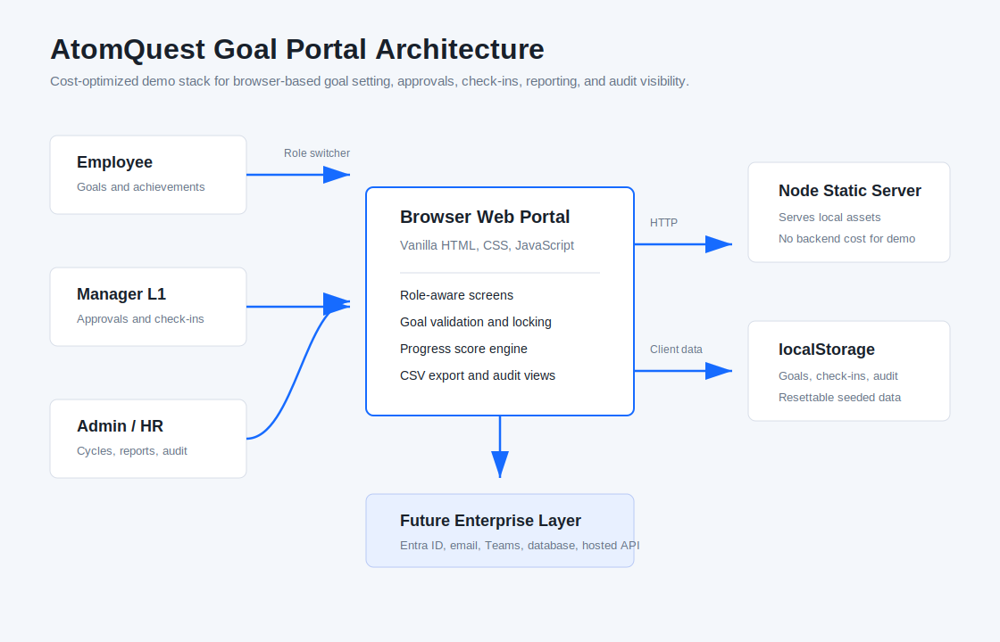

# AtomQuest Goal Setting & Tracking Portal

An end-to-end browser-based Goal Setting and Tracking Portal built for the AtomQuest Hackathon 1.0 problem statement.

The portal covers employee goal creation, manager approval, quarterly achievement tracking, admin governance, reporting, auditability, escalation, and integration-ready workflows.

## Live Demo

```text
https://files-mentioned-by-the-user-6a06fcd.vercel.app
```

## Run Locally

```powershell
npm start
```

Then open:

```text
http://127.0.0.1:8797/
```

No database or cloud account is required. Data is stored in browser `localStorage` for fast demo setup.

## Demo Access

Use the role switcher in the left sidebar.

| Persona | Demo User | What To Demo |
| --- | --- | --- |
| Employee | Aarav Mehta, Nisha Rao, Kabir Singh | Create goals, submit goal sheet, update quarterly actuals, view feedback and notifications |
| Manager L1 | Priya Nair, Rohan Shah | Review goals, edit target or weightage inline, approve or return, log quarterly check-ins, push shared KPIs |
| Admin / HR | HR Admin | Manage cycles, unlock exceptions, view completion dashboard, export reports, run escalations, inspect audit trail and integrations |

## Core Features

- Employee goal sheet creation.
- Thrust area, goal title, description, UoM, target, deadline, and weightage capture.
- Validation rules:
  - total weightage must equal `100%`
  - minimum goal weightage is `10%`
  - maximum `8` goals per employee
- L1 manager approval workflow.
- Inline target and weightage edits during manager approval.
- Return-for-rework flow.
- Goal locking after approval.
- Admin unlock exception handling.
- Shared departmental goals.
- Shared goal title and target read-only for recipients.
- Recipient-adjustable shared goal weightage.
- Primary-owner actual achievement sync across linked shared goals.
- Quarterly achievement capture for Q1, Q2, Q3, and Q4.
- Status tracking: Not Started, On Track, Completed.
- Planned vs actual visibility.
- Structured manager check-in comments.
- Progress scoring for:
  - Min Numeric / Min %
  - Max Numeric / Max %
  - Timeline
  - Zero-based goals

## Admin And Governance

- Active cycle configuration.
- Quarterly schedule view.
- Completion dashboard.
- Achievement report.
- CSV export.
- Excel-compatible `.xls` export.
- Audit trail for workflow, admin, notification, sync, and exception events.
- Rule-based escalation module.
- Notification center with deep-link style navigation.

## Bonus Features

- Microsoft Entra ID integration simulation:
  - directory sync
  - reporting-line mapping
  - role group mapping
- Email notification simulation.
- Microsoft Teams notification simulation.
- Reminder batch flow.
- Escalation notification chain.
- Analytics module:
  - quarter-on-quarter achievement trends
  - department check-in completion
  - goal distribution by thrust area
  - manager effectiveness dashboard
- Dark mode and light mode toggle.

## Architecture



## Tech Stack

- HTML
- CSS
- Vanilla JavaScript
- Node.js static file server
- Browser `localStorage`

## Project Structure

```text
.
├── app.js
├── architecture.svg
├── index.html
├── package.json
├── README.md
├── server.js
└── styles.css
```

## Validation

```powershell
npm run check
```

The check script validates both JavaScript entry points:

- `app.js`
- `server.js`

## Production Notes

This repository is intentionally runnable as a local hackathon demo. In production, the simulated integration layers would be replaced with:

- Microsoft Entra ID authentication.
- Microsoft Graph user and manager sync.
- A real backend API.
- A persistent database.
- Real email delivery.
- Microsoft Teams bot or adaptive cards.
- Hosted deployment on Azure, Vercel, Render, or a similar platform.
